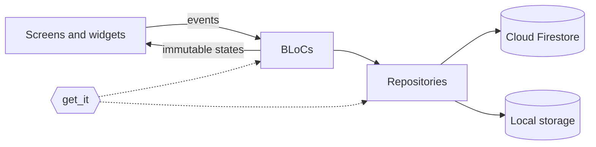
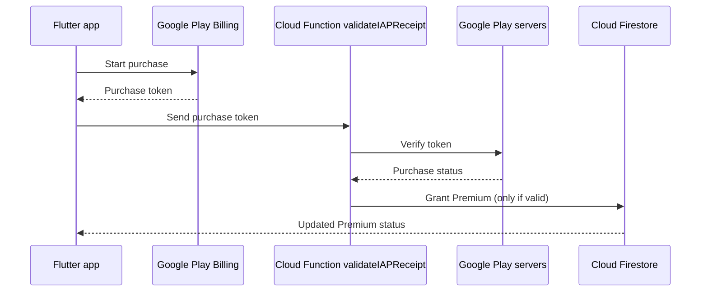

<!-- markdownlint-disable MD033 MD041 MD029 -->
<div align="center">
  
  <h1>Vowl</h1>
  <p><b>A gamified language-learning app built with Flutter and Firebase.</b></p>

  [](https://flutter.dev)
  [](https://dart.dev/)
  [](https://firebase.google.com/)
  [](https://bloclibrary.dev/)
  
</div>

---

## Overview

Vowl is a gamified language-learning app with a separate Kids Zone. It has **100+ game types**, a **200-level curriculum per game**, and **60,000+ learning challenges** across vocabulary, grammar, listening, speaking, reading, writing, and more.

I designed and built everything myself: the Flutter app, the Firebase backend, and the Cloud Function that validates in-app purchases.

**Status:** Google Play release in progress.

[Features](#features) · [Architecture](#architecture) · [Security](#security-and-backend) · [Design decisions](#design-decisions) · [Getting started](#getting-started)

### Technical highlights

- **BLoC + get_it:** business logic lives in BLoCs, and dependencies are injected, so services are easy to swap and test.
- **Shared game logic:** a generic `GameScreenMixin<T>` removes duplicated timer, scoring, lifecycle, and haptics code across 60+ game screens.
- **Server-side purchase validation:** a Node.js Firebase Cloud Function verifies Google Play purchase tokens before Premium is granted.
- **Security Rules:** Firestore and Cloud Storage rules restrict users to their own data and validate XP updates.
- **Speech and audio:** speech recognition and text-to-speech for speaking and listening games.
- **UI and rendering:** a glassmorphic interface built with `flutter_animate`, plus an animated mesh-gradient background drawn with `CustomPainter`.

<!--
## Screenshots

Add real screenshots to docs/screenshots/ and uncomment this section.

<div align="center">
  
  
  
  
</div>

Demo video: [Watch on YouTube](PASTE_YOUR_VIDEO_LINK_HERE)
-->

---

## Features

### Games and curriculum

- 100+ game types, including vocabulary, grammar, pronunciation, typing, matching, and listening comprehension.
- Up to 200 levels per game. Curriculum content is bundled as assets and organized by category (`assets/curriculum/`).
- Games pause and resume with the app lifecycle through a custom `AppLifecycleHandler`.
- Haptic and sound feedback for correct and wrong answers, managed in one place.

### Speech and audio

- Speech recognition for speaking and pronunciation exercises.
- Text-to-speech for listening games.

### Progress and rewards

- XP and level system.
- Timezone-aware daily streaks.
- Achievements, badges, and leaderboards.

### Kids Zone

- Simplified interface with 25 learning topics, including alphabet, numbers, colors, animals, phonics, and handwriting.
- Parental gate: randomized math questions protect settings, external links, and purchases.

### Accounts and monetization

- OAuth (Google Sign-In) and email login.
- AdMob banner and interstitial ads.
- Premium subscriptions and one-time coin packs through Google Play Billing.
- Razorpay integration as an alternative payment gateway for the Indian market, subject to Google Play's payments policy.

---

## Architecture



The project uses a feature-first structure:

```text
lib/
 ├── core/
 │    ├── presentation/      # Shared mixins and base widgets (e.g. GameScreenMixin)
 │    ├── theme/             # AppTheme, dimensions, colors
 │    └── utils/             # Helpers, lifecycle handlers
 ├── features/
 │    ├── auth/              # OAuth, email login, legal consents
 │    ├── home/              # Dashboards, category shelves
 │    ├── games/             # The 100+ game types
 │    ├── kids_zone/         # Parental gate, kids UI
 │    ├── profile/           # Streaks, leaderboards, settings
 │    └── monetization/      # IAP repositories, paywalls
 ├── config/                 # Environment variables, keys
 └── main.dart               # Entry point and DI setup
extensions/                  # Infrastructure-as-Code for Firebase Extensions
 └── delete-user-data.env    # Safe, non-secret configuration (Firebase Best Practice)
functions/
 ├── index.js                # Server-side purchase validation (Node.js)
 └── package.json            # googleapis, firebase-admin
```

> **Note on Infrastructure-as-Code:** The `extensions/` directory is safely committed to source control following Firebase's modern "Extensions-as-Code" architecture. It contains structural configuration parameters (like Firestore deletion paths) and no sensitive secrets, ensuring infrastructure reproducibility across environments.

### State management: BLoC

Business logic lives in BLoCs. Widgets send events (for example `SubmitAnswerEvent` and `PauseGameEvent`) and rebuild from immutable states.

### Dependency injection: get_it

Repositories, network clients, and local storage managers are registered with `get_it`, so they can be replaced or mocked.

### Shared game logic: mixins

60+ game screens need the same timer ticks, score tracking, lifecycle pausing, and haptics. A generic `GameScreenMixin<T>` keeps that logic in one place, and screens add feature-specific behavior with extra mixins, for example `with GameScreenMixin<Widget>, GrammarFeatureMixin`.

### Rendering performance

The animated background uses `CustomPainter` instead of image assets. It batches points with `canvas.drawPoints` and minimizes allocations inside the paint loop to keep the animation smooth. Debug logging is wrapped in `kDebugMode`, so it does not run in release builds.

---

## Security and backend

The app treats the client as untrusted. It does not decide that a purchase is valid: it sends the purchase token to a Cloud Function, which verifies it with Google Play and then grants Premium in Firestore.



The function is written in Node.js and uses `googleapis` and `firebase-admin`.

### Firestore and Storage Security Rules

- Users can read and write only their own documents (`request.auth.uid == resource.id`).
- Rules validate XP updates (values must stay within valid bounds) to limit client-side tampering.

---

## Design decisions

| Decision | Why | Trade-off |
| --- | --- | --- |
| BLoC for state | Games have many state changes (timer, score, pause, answers). Events and immutable states keep transitions predictable and testable. | More boilerplate than Provider or Cubit for simple screens. |
| One generic `GameScreenMixin<T>` | 60+ game screens share timers, scoring, lifecycle pausing, and haptics. | Mixins can hide dependencies; a separate controller class would be more explicit. |
| Curriculum bundled as assets | Content works offline and costs no database reads. | Larger app size, and new content needs an app release. |
| Server-side purchase validation | The client cannot be trusted to say that a purchase happened. | Needs a Cloud Function and Google service-account setup to maintain. |
| `CustomPainter` for the animated background | Avoids heavy image assets and expensive layout work. | Custom painting code is harder to maintain than widgets. |

---

## Tech stack

| Area | Technologies |
| --- | --- |
| App | Flutter, Dart |
| State and DI | flutter_bloc, equatable, get_it |
| Navigation | go_router |
| Backend | Firebase Auth, Cloud Firestore, Cloud Storage, Cloud Functions (Node.js) |
| Payments and ads | in_app_purchase (Google Play Billing), razorpay_flutter, google_mobile_ads |
| Voice and audio | speech_to_text, flutter_tts, audioplayers |
| UI | flutter_animate, flutter_screenutil, shimmer, cached_network_image |

---

## Getting started

### Prerequisites

- Flutter SDK (stable channel)
- Node.js and the Firebase CLI (for Cloud Functions)
- A Firebase project
- A Google Play Console account (for testing in-app purchases)

### Run the app

1. Clone the repo:

```bash
   git clone https://github.com/vowl-official/vowl-app.git
   cd vowl-app
```

2. Install dependencies:

```bash
   flutter pub get
```

3. Create a `.env` file in the project root. It is bundled as an asset and loaded with `flutter_dotenv`, so anyone can read it from the built app. Put only public identifiers in it (for example a Razorpay key ID) and keep all secrets on the server.

4. Add your Firebase config files:
   - Android: `android/app/google-services.json`
   - iOS: `ios/Runner/GoogleService-Info.plist`

5. Deploy the Cloud Function (needed for purchase validation):

```bash
   cd functions
   npm install
   firebase deploy --only functions:validateIAPReceipt
```

6. Run the app:

```bash
   flutter run
```

---

## Legal

Policies are hosted on GitHub Pages for store listings:

- [Privacy Policy](https://vowl-official.github.io/vowl-legal/privacy.html)
- [Terms of Service](https://vowl-official.github.io/vowl-legal/terms.html)
- [Refund Policy](https://vowl-official.github.io/vowl-legal/refund.html)

---

<p align="center">Built by <b>Vowl Team</b> · <a href="https://github.com/vowl-official">GitHub</a> </p>

<!-- When live on Google Play: replace the "status" badge at the top with this -->
[](https://play.google.com/store/apps/details?id=YOUR.APP.ID)

<!-- After you have real tests + .github/workflows/ci.yml: add this section -->
## Testing

```bash
flutter analyze
flutter test
```

[](https://github.com/vowl-official/vowl-app/actions/workflows/ci.yml)

<!-- Only after you verify your rules block client writes to entitlement fields: add to the Security Rules list -->
- Clients cannot write entitlement fields such as Premium; only the Cloud Function can.

